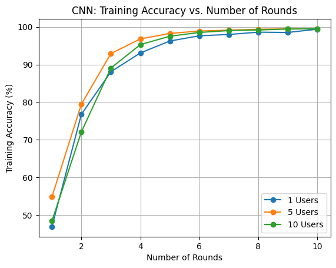
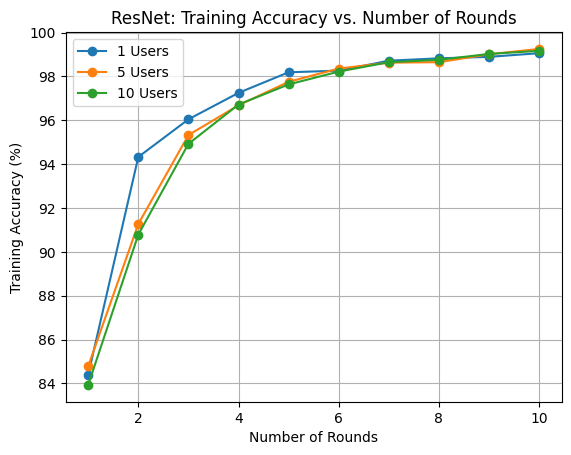

# **Federated vs. Centralized Learning for WiFi Sensing using CNN and ResNet-18**

## **Overview**

This project investigates the effectiveness of **Federated Learning (FL) vs. Centralized Learning (CL)** for **WiFi-based Human Activity Recognition**. It evaluates **CNN and ResNet-18** under both training paradigms using the **UT-HAR dataset**.

### **Why Federated Learning?**

- **Privacy-Preserving** – Data remains on local devices.
- **Decentralized Training** – No need for a centralized dataset.
- **Efficient Model Aggregation** – Uses **FedAvg** to combine local updates.

## **Key Features**

- **Comparison between FL and CL** using CNN and ResNet-18.
- **UT-HAR dataset** for human activity recognition.
- **Implementation of Federated Averaging (FedAvg)**.
- **Performance evaluation with multiple clients**.

## **Dataset: UT-HAR**

- **Size**: \~17GB
- **Source**: University of Toronto
- **Data Format**: WiFi CSI measurements from **3 antennas & 30 subcarriers**.
- **Activities**:
  - Lying down
  - Falling
  - Walking
  - Running
  - Sitting down
  - Standing up
- **Setup**:
  - **WiFi Router (transmitter)**
  - **Laptop with Intel 5300 NIC (receiver)**
  - **Indoor Office Environment**

## **Federated vs. Centralized Learning**

### **1. Centralized Learning (CL)**

- **All data is stored on a central server.**
- **One global model** is trained on the complete dataset.
- **Uses backpropagation for model updates.**

### **2. Federated Learning (FL)**

- **Clients train locally on their data.**
- **Only model updates are shared with the server.**
- **Server aggregates weights using FedAvg.**

## **Federated Learning Workflow**

1. **Global Model Initialization** – CNN/ResNet-18 models are initialized.
2. **Local Training** – Each client trains on its dataset.
3. **Weight Updates Sent to Server** – Clients send model weights, not raw data.
4. **FedAvg Aggregation** – Server averages the weights.
5. **Repeat for multiple rounds** until convergence.
6. **Final Evaluation** – Global model is tested on unseen data.

## **Training Details**

### **Global Rounds and Local Epochs**
- **Number of Global Rounds**: 10
- **Number of Local Epochs per Client**: 3

### **Centralized Learning (CL)**

- Standard training with **Adam optimizer & CrossEntropyLoss**.
- Model updates based on gradient descent.

### **Federated Learning (FL)**

- **Clients train locally** for multiple epochs before sharing updates.
- **FedAvg aggregates model weights** instead of sharing data.
- **Experiments with varying numbers of clients**:
  - **1 client** (baseline)
  - **5 clients**
  - **10 clients**

## **Results & Insights**

### **Federated Learning vs. Centralized Learning Performance**

| Clients | Model  | Training Accuracy (Final) | Test Accuracy |
| ------- | ------ | ------------------------- | ------------- |
| 1       | CNN    | 99.38%                    | 95.00%        |
| 1       | ResNet | 99.06%                    | 59.60%        |
| 5       | CNN    | 99.48%                    | 96.80%        |
| 5       | ResNet | 99.26%                    | 95.60%        |
| 10      | CNN    | 99.48%                    | 97.40%        |
| 10      | ResNet | 99.17%                    | 98.60%        |

### **Key Takeaways**

- **Federated Learning (FL) with ResNet-18 performed better than CNN for larger client distributions.**
- **For a single client, CNN outperformed ResNet-18 on test accuracy.**
- **FL achieved similar accuracy to CL while preserving privacy.**
- **FedAvg aggregation improved model stability across multiple rounds.**
- **Higher learning rates led to faster convergence but required tuning.**

## **Conclusion**

- **Federated Learning enables privacy-preserving WiFi sensing applications.**
- **Performance varied based on the number of clients and model architecture, with different trade-offs observed in accuracy across different settings.**
- **FL is suitable for applications like smart homes and healthcare.**

## **References**

1. **WiFi Sensing Research** – [IEEE Communications Magazine, Vol. 55, No. 10](https://doi.org/10.1109/MCOM.2017.1700082)
2. **Federated Learning Security & Privacy** – [Future Generation Computer Systems, 2021](https://doi.org/10.1016/j.future.2020.10.007)
3. **WiFi Sensing with FL** – [IEEE IoT Journal, 2022](https://doi.org/10.1109/JIOT.2021.3137793)

